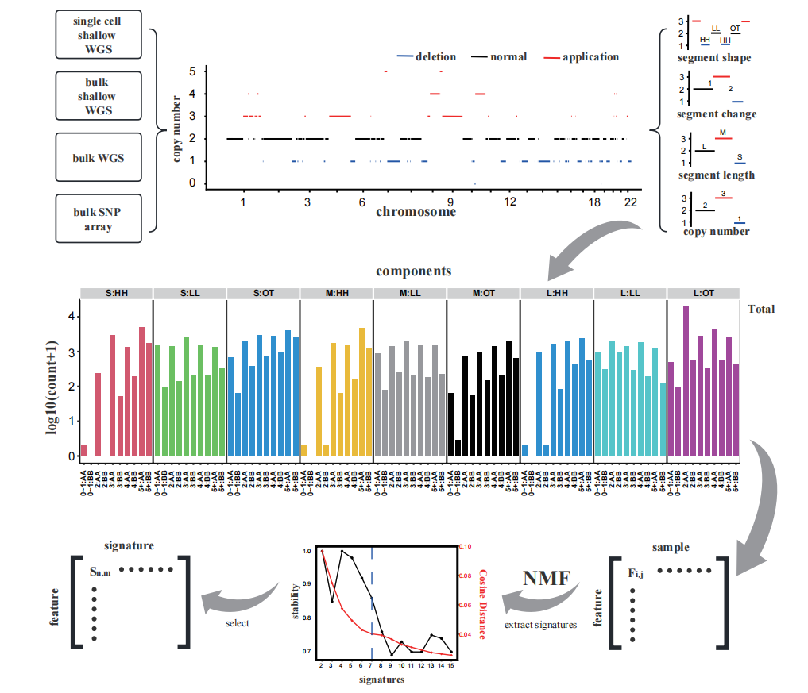

# single-cell-CNA-signature
This repository provides the analysis reports, code and data for readers who are insterest in this project and make it easier to reproduce the whole analysis procedure.

## Workflow

## Contributors

Please contact Chenxu Wu: [wuchx@shanghaitech.edu.cn](mailto:wuchx@shanghaitech.edu.cn) for any questions or suggestions. Thank you for your support and feedback.

## Note

Since this study uses a large amount of raw sequencing data obtained through private applications, we are unable to upload and publicly share the raw data. However, anyone can request the raw data from the original authors. For data generated during this study, anyone requiring this data can contact us directly via GitHub or email, and we will provide all necessary data files. 

